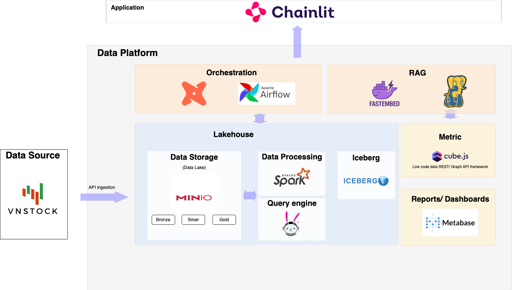
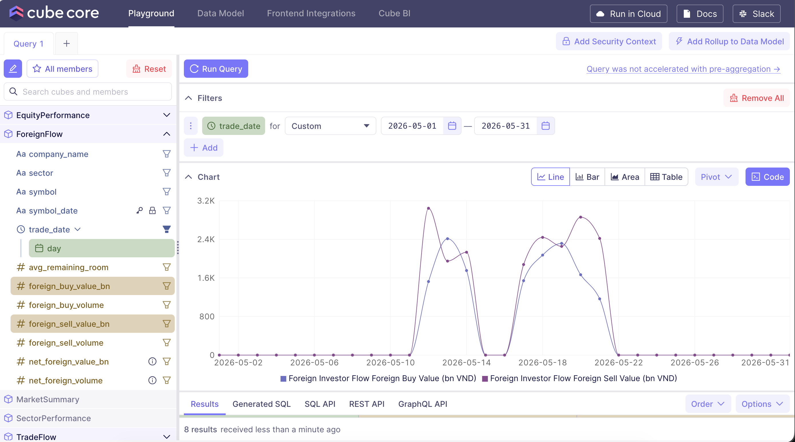
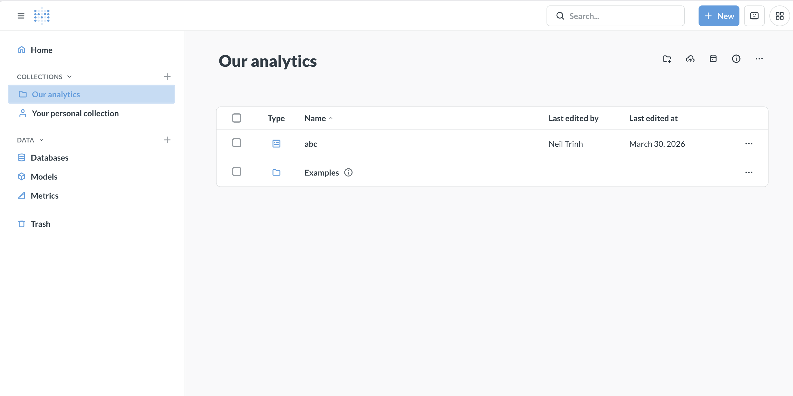
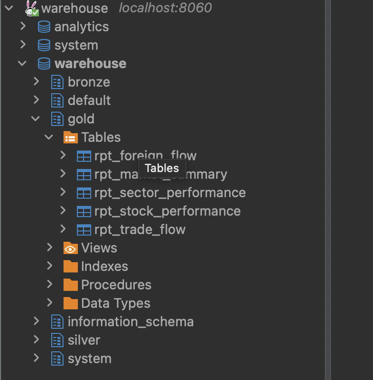
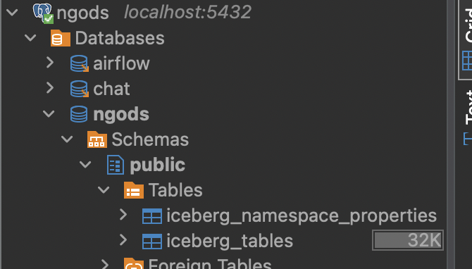
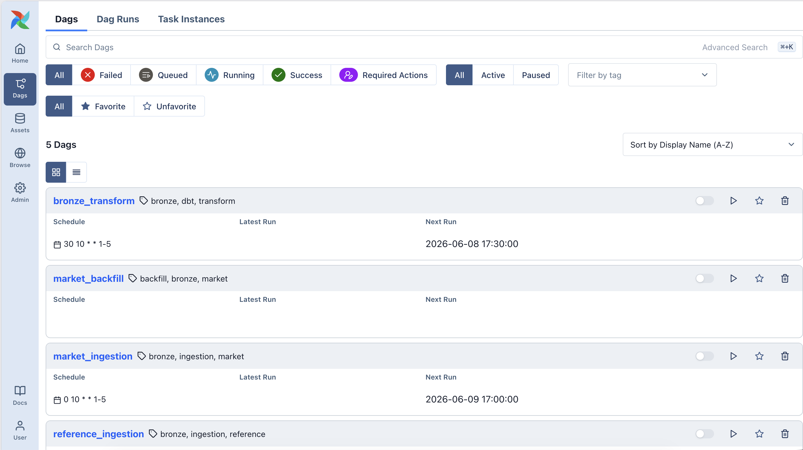
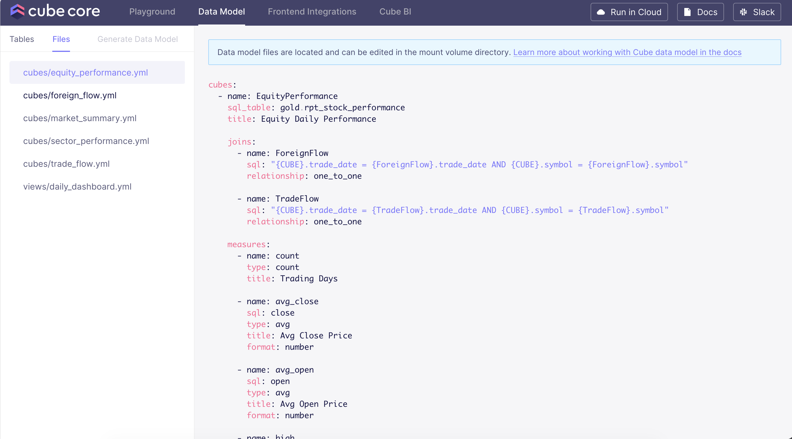
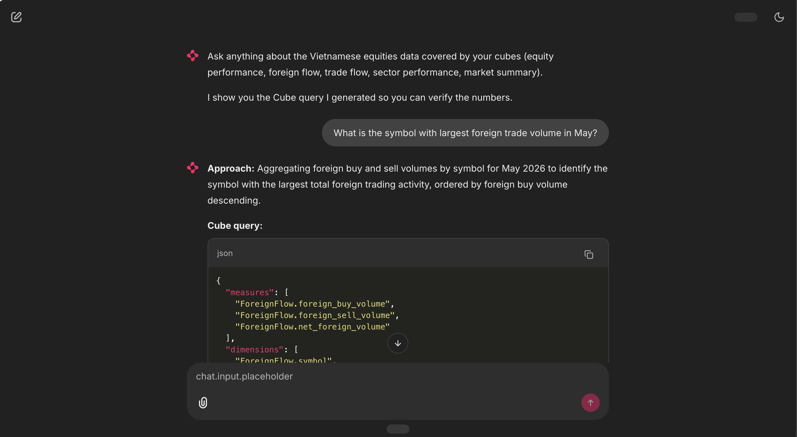

# Modern Data Platform demo: VN stock market
This repository contains a Vietnamese stock market analysis, as a demo of the modern data stack. The demo performs the following steps:

1. Download Vietnamese equity and index data from [vnstock](https://github.com/thinh-vu/vnstock).
2. Store the stock data in the data platform (using [Iceberg](https://iceberg.apache.org/) format).
3. Transform the data (e.g. normalize stock prices, calculate report tables) using [dbt](https://www.getdbt.com/).
4. Expose an analytics data model using [cube.dev](https://cube.dev/).
5. Visualize data as reports and dashboards using [Metabase](https://www.metabase.com/).
6. Chat with your data using a semantic-layer-first AI co-pilot powered by [Claude](https://www.anthropic.com/claude) and [Chainlit](https://chainlit.io/).

The demo is packaged as a [docker-compose](https://github.com/docker/compose) script that downloads, installs, and runs all components of the data stack.

This project is folked and upgraded from [Zsvoboda's repo](https://github.com/zsvoboda/ngods-stocks)

# Data Platform components

It includes the following components:

- [Apache Spark](https://spark.apache.org) for data transformation, provided as Thrift server through Apache Kyuubi
- [Apache Iceberg](https://iceberg.apache.org) as table format
- [Trino](https://trino.io/) for federated data query
- [dbt](https://www.getdbt.com/) for ELT management
- [Apache Airflow](https://airflow.apache.org/) for data orchestration
- [cube.dev](https://cube.dev/) for data analysis and semantic data model
- [Metabase](https://www.metabase.com/) for data visualization (dashboards)
- [OpenMetadata](https://open-metadata.org/) for the data catalog, lineage, and governance
- [Minio](https://min.io) for local S3 storage
- [pgvector](https://github.com/pgvector/pgvector) for vector search (used by the chat feature)




# Running the demo
DP requires a machine with at least 16GB RAM and Intel or ARM 64 CPU running [Docker](https://www.docker.com/). It requires [docker-compose](https://github.com/docker/compose).

1. Clone the [Gitlab repo](https://github.com/nghiatrh/ngods-stocks.git)

```bash
git clone https://github.com/nghiatrh/ngods-stocks.git
```

2. Set your Anthropic API key (required for the chat feature):

```bash
echo 'ANTHROPIC_API_KEY=sk-ant-...' >> .env
```

3. Start the data stack:

```bash
cd ngods-stocks
docker-compose up -d
```

**NOTE:** This can take quite long depending on your network speed.

4. Stop the data stack:

```bash
docker-compose down
```

5. Execute the data pipeline from the Airflow UI at http://localhost:8080 (username `airflow` / password `airflow`).

   The following DAGs are available:

   | DAG | Schedule | Description |
   |-----|----------|-------------|
   | `reference_ingestion` | manual / on-demand | Ingest equity listing and reference data |
   | `market_ingestion` | weekdays 17:00 ICT | Daily ingestion of VN30 equity and index OHLCV |
   | `market_backfill` | manual | Backfill historical market data |
   | `bronze_transform` | triggered | dbt bronze-stage transformations |
   | `silver_gold_transform` | triggered | dbt silver + gold-stage transformations |

6. Review and customize the [cube.dev metrics and dimensions](./conf/cube/schema/). Test these metrics in the [cube.dev playground](http://localhost:4000).

   

   See the [cube.dev documentation](https://cube.dev/docs/) for more information.

7. Check out the Metabase [data visualizations](http://localhost:3030) connected to the cube.dev analytical model.

   Use username `metabase@ngods.com` and password `metabase1`.

   

8. Use the **chat-with-data** co-pilot at http://localhost:8501 to ask questions about the Vietnamese stock market in layman language.

   Before using the chat for the first time, build the RAG index:

   ```bash
   curl -X POST http://localhost:8001/ingest
   ```

   Then open the Chainlit UI at http://localhost:8501 and start asking questions like *"Which stocks had the biggest gain today?"*.

   Re-run `/ingest` whenever you add or change a cube YAML or dbt `schema.yml`.

   See [projects/chat/README.md](./projects/chat/README.md) for full details.

9. If you want to query data directly. Download [DBeaver](https://dbeaver.io/download/) SQL tool.

10. Connect to the Trino database that has access to all data stages (`bronze`, `silver`, and `gold` schemas of the `warehouse` database). Use `jdbc:trino://localhost:8060` JDBC URL with username `trino` and no password.


    

11. Connect to the Postgres database that contains the `iceberg catalog`, `airflow` database, and `embedding data` rag. Use `jdbc:postgresql://localhost:5432/ngods` JDBC URL with username `ngods` and password `ngods`.

    


# Customizing the demo
This chapter contains useful information for customizing the demo.


## DP endpoints
The data stack exposes the following endpoints:

- Spark
    - http://localhost:8888 — Jupyter notebooks
    - `jdbc:hive2://localhost:10009` JDBC URL (no username / password)
    - localhost:7077 — Spark API endpoint
    - http://localhost:18080 — Spark history server
- Trino
    - `jdbc:trino://localhost:8060` JDBC URL (username `trino` / no password)
- Postgres
    - `jdbc:postgresql://localhost:5432/ngods` JDBC URL (username `ngods` / password `ngods`)
- Cube.dev
    - http://localhost:4000 — cube.dev development UI
    - `jdbc:postgresql://localhost:3245/cube` JDBC URL (username `cube` / password `cube`)
- Metabase
    - http://localhost:3030 — Metabase UI (username and password are created by user)
- OpenMetadata
    - http://localhost:8585 — OpenMetadata UI (username `admin@open-metadata.org` / password `Admin1234!`)
- Airflow
    - http://localhost:8080 — Airflow UI (username `airflow` / password `airflow`)
- Minio
    - http://localhost:9001 — Minio UI (username `minio` / password `minio123`)
- Chat API
    - http://localhost:8001 — FastAPI (`/ingest`, `/ask`, `/health`)
- Chat UI
    - http://localhost:8501 — Chainlit co-pilot UI

## DP databases: Spark, Trino
DP includes two database engines: Spark and Trino. Both Spark and Trino have access to Iceberg tables in `warehouse.bronze` `warehouse.silver`, and `warehouse.gold` schemas. 

The Spark engine is configured for data transformation.


The Trino engine is configured for adhoc query on Iceberg tables. Additional catalogs can be [configured](./conf/trino/catalog) as needed.


## Postgres database
The Postgres database plays multiple roles in the system 
1. Airflow database 
2. Back the Iceberg catalog (using JDBC-backed Iceberg catalog)
3. Database of chat, store queries and feedbacks under `chat.log` schema and as the vector store (`chat.rag.chunks`) for the chat co-pilot.

## Demo data pipeline
The demo data pipeline uses the [medallion architecture](https://databricks.com/fr/glossary/medallion-architecture) with `bronze`, `silver`, and `gold` stages.

The pipeline consists of the following phases:

1. Data are downloaded from the vnstock API into the local Minio bucket using Airflow DAGs (`reference_ingestion`, `market_ingestion`, `market_backfill`).
2. The raw CSV/Parquet files are loaded to the bronze stage Iceberg tables (`warehouse.bronze`) via dbt models executed in Spark ([`projects/dbt/bronze_vnstock`](./projects/dbt/bronze_vnstock/)).
3. Silver stage Iceberg tables (`warehouse.silver`) are created via dbt models executed in Spark ([`projects/dbt/silver_vnstock`](./projects/dbt/silver_vnstock/)).
4. Gold stage Iceberg tables (`warehouse.gold`) are created via dbt models executed in Spark, too ([`projects/dbt/gold_vnstock`](./projects/dbt/gold_vnstock/)).


All pipeline phases are orchestrated by [Apache Airflow](https://airflow.apache.org/). DAG definitions live in [`projects/airflow/dags/`](./projects/airflow/dags/).



## ngods analytics layer
ngods includes [cube.dev](https://cube.dev/) for the [semantic data model](./conf/cube/schema) and [Metabase](https://www.metabase.com/) for self-service analytics.


The semantic model is defined in cube.dev and governs all analytical queries over the gold data.



[Metabase](https://www.metabase.com/) is connected to cube.dev via the [SQL API](https://cube.dev/docs/backend/sql). End users can create dashboards, reports, and data visualizations. Metabase is also directly connected to the data on DP through Trino.


## Metadata catalog: OpenMetadata
[OpenMetadata](https://open-metadata.org/) provides the data catalog, column-level documentation, lineage, and data-quality results for the platform. It runs as the `openmetadata-server` (UI at http://localhost:8585) backed by `elasticsearch` for search and the `openmetadata` Postgres database; ingestion runs in the bundled `openmetadata-ingestion` container.

Metadata is populated in two passes by [`bin/setup_openmetadata.sh`](./bin/setup_openmetadata.sh):

1. A **Trino** crawl of the `warehouse` catalog registers the physical `bronze`/`silver`/`gold` tables.
2. Three **dbt** workflows (one per project) attach model and column descriptions, `bronze → silver → gold` lineage from the dbt `ref()` graph, and `dbt test` results on top of those tables.

Ingestion configs live in [`projects/openmetadata/`](./projects/openmetadata/). The transform DAGs run `dbt docs generate` and `dbt test` so the catalog stays current on each pipeline run; re-run `bin/setup_openmetadata.sh` to refresh the catalog after a pipeline run.

## Data description
8 bronze (4 market + 4 reference) + 3 silver (1 dim + 2 fact) + 5 gold reporting models.
**Bronze**

*Market data (incremental, append-only, partitioned by trade_date):*

1. stg_equity_ohlcv	Daily equity OHLCV bars from bronze/market/equity_ohlcv/.
2. stg_equity_order_book	Equity order-book snapshots (incl. foreign buy/sell totals).
3. stg_equity_trades	Tick-level matched equity trades.
4. stg_index_ohlcv	Daily index OHLCV bars (VNINDEX, VN30, etc.).

*Reference data (full table rebuilds):*

5. stg_equity_listing	Listed-equity master/listing reference.
6. stg_events	Corporate events reference.
7. stg_index_listing	Index listing reference.
8. stg_industry	ICB industry classification reference.

**Silver**

1. dim_equity	Equity dimension — one row per symbol, enriched with ICB industry classification (levels 1–4: codes + names). Full rebuild each run.
2. fct_equity_daily	Daily equity facts, one row per (trade_date, symbol). Adds prior_close, pct_change, intraday_range_pct (volatility proxy), and volume_ratio_20d (vs 20-session avg).
3. fct_index_daily	Daily index facts for VNINDEX/VN30/HNX30/UPCOM. Adds prior_close, pct_change, and ytd_return_pct.

**Gold**

1. rpt_market_summary	Daily market-breadth summary across VN30 — one row per date. Advancers/decliners/unchanged, total traded value & volume, avg/top/bottom returns. Drives market-wide dashboard tiles.
2. rpt_stock_performance	Daily per-stock performance joined with company + sector metadata. One row per (trade_date, symbol). Stock-level drill-down.
3. rpt_sector_performance	Daily sector-level aggregation (ICB level-3) from VN30 equities. Advancers/decliners, avg return, top/bottom mover, traded value/volume per sector.
4. rpt_foreign_flow	Daily foreign-investor buy/sell flow per symbol from order-book snapshots. Net foreign volume/value and remaining foreign ownership room.
5. rpt_trade_flow	Daily intraday trade-flow per symbol from tick data. Trade count, VWAP, avg trade size, buy/sell volume and buy_ratio (buy-pressure indicator).

## Chat with data
The chat co-pilot is a **semantic-layer-first** AI agent: the LLM never sees raw SQL — it sees Cube measures and dimensions, and emits Cube REST queries. This keeps metric definitions governed and dramatically reduces hallucinations.


Key components:

| Component | Description |
|-----------|-------------|
| `projects/chat/app/ingest.py` | Pulls Cube `/meta` + dbt `manifest.json`, embeds with **fastembed** (`bge-small-en-v1.5`), and writes to `chat.rag.chunks` (pgvector) |
| `projects/chat/app/retriever.py` | Vector search; returns full cube schemas behind the top-k hits |
| `projects/chat/app/router.py` | Single Claude call → JSON Cube query |
| `projects/chat/app/guardrails.py` | Schema-grounded validation; rejects unknown measures/dimensions before execution |
| `projects/chat/ui/chainlit_app.py` | Co-pilot UI: question → query → table with thumbs up/down feedback |

See [projects/chat/README.md](./projects/chat/README.md) for full setup and evaluation instructions.

# Support
Create a [github issue](https://github.com/zsvoboda/ngods-stocks/issues) if you have any questions.
